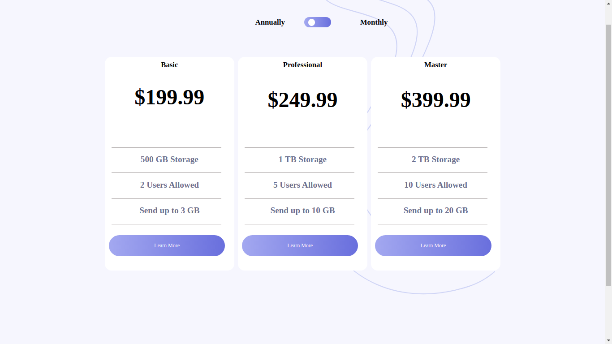

# Frontend Mentor - Tip calculator app solution

This is a solution to the [Tip calculator app challenge on Frontend Mentor](https://www.frontendmentor.io/challenges/tip-calculator-app-ugJNGbJUX). Frontend Mentor challenges help you improve your coding skills by building realistic projects.

## Table of contents

- [Overview](#overview)
  - [The challenge](#the-challenge)
  - [Screenshot](#screenshot)
  - [Links](#links)
- [My process](#my-process)
  - [Built with](#built-with)
  - [What I learned](#what-i-learned)
  - [Author](#author)

## Overview

### The challenge

Users should be able to:

- View the optimal layout for the component depending on their device's screen size
- Control the toggle with both their mouse/trackpad and their keyboard
- **Bonus**: Complete the challenge with just HTML and CSS

### Screenshot

### Links

- Solution URL: [Add solution URL here](https://github.com/WalterSiqueira/pricing_component)
- Live Site URL: [Add live site URL here](https://pricing-component-ruddy.vercel.app/)

## My process

### Built with
- layout built from mobile to desktop and devided into three sizes on media-queries
- Semantic HTML5 markup
- CSS custom properties
- CSS Grid
- sass preprocessor
- javascript 

### What I learned

In this project i learned to work with javascript and to manage elements and states. also i've improved my skills at css and learned to use sass preprocessors 

### Continued development

In this project unfortunately didn't had time to make the animation of each option but i'll do in the near future

## Author
- GitHub - [WalterSiqueira](https://github.com/WalterSiqueira)
- Frontend Mentor - [@WalterSiqueira](https://www.frontendmentor.io/profile/WalterSiqueira)
- Twitter - [@Walter__BS](https://twitter.com/Walter__BS)
